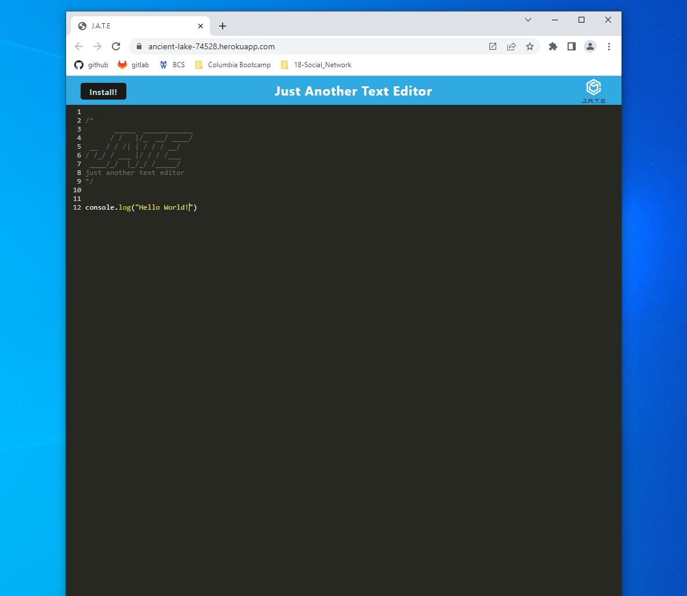
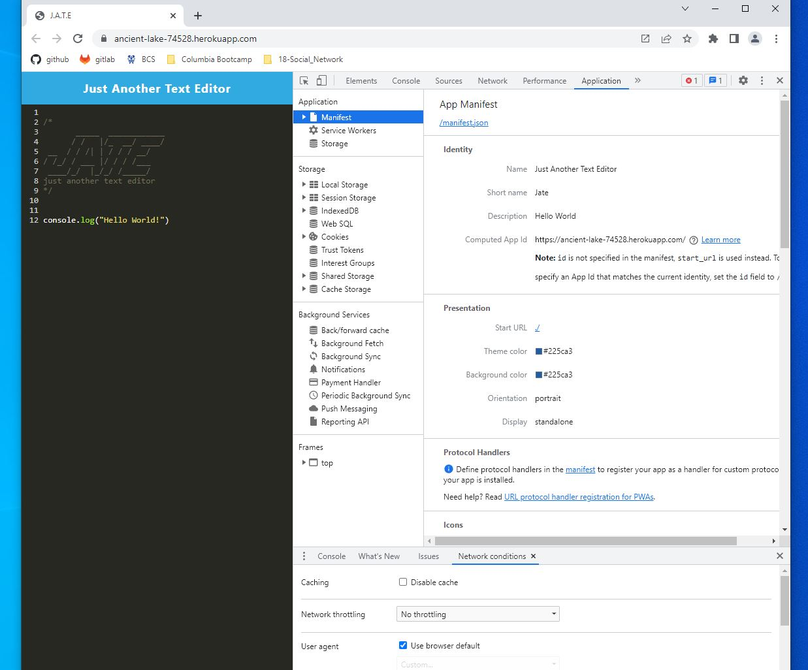
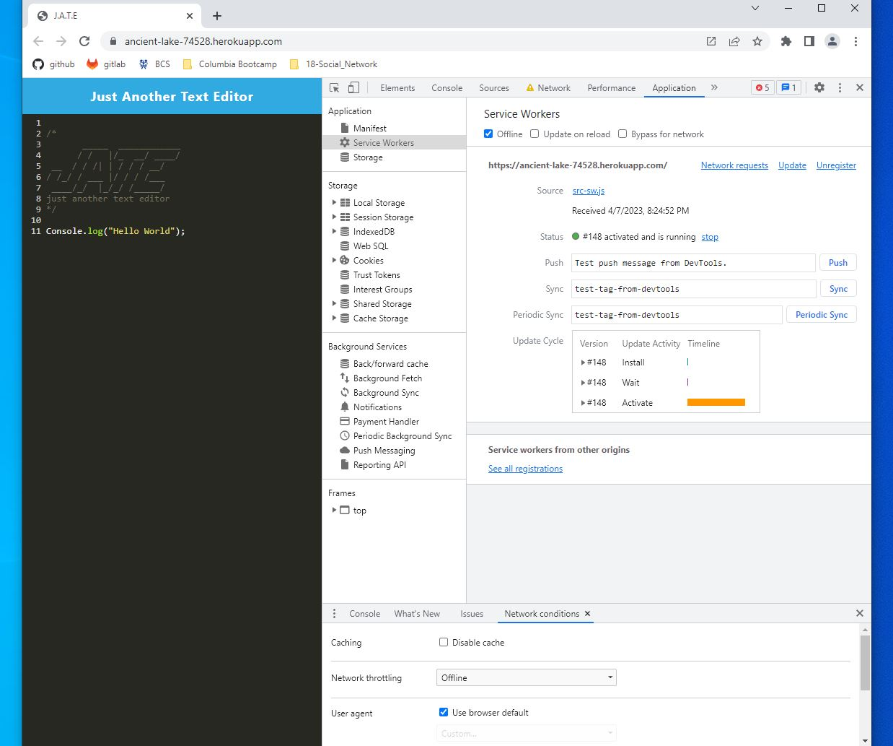
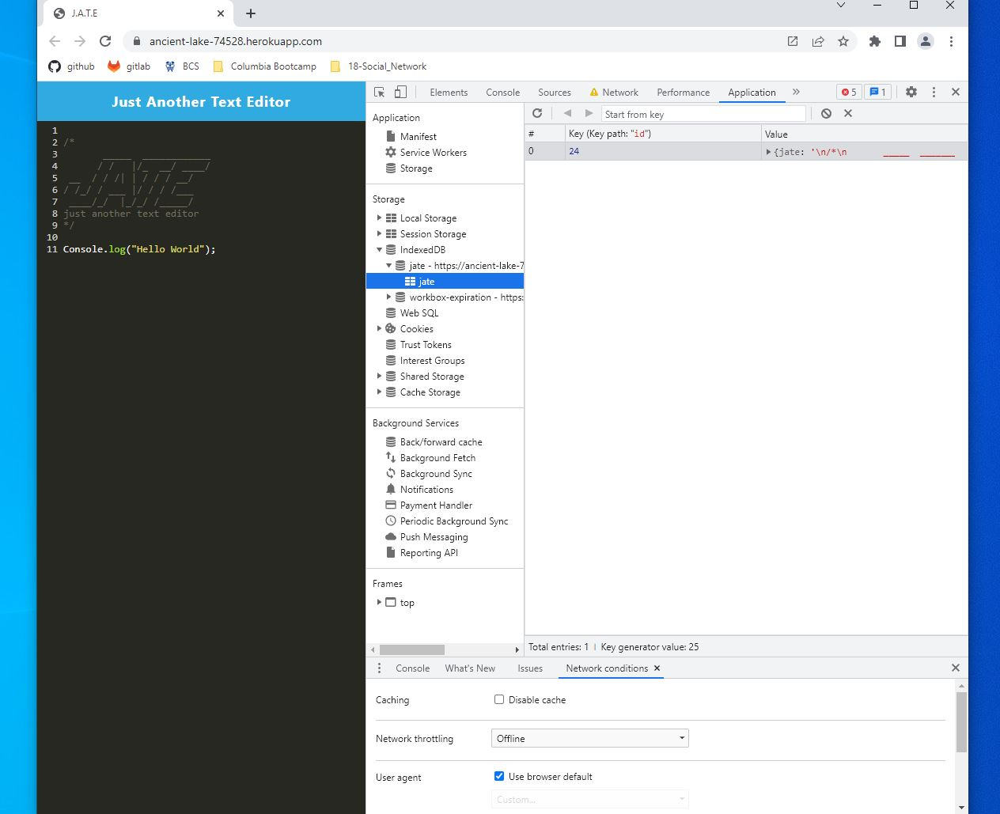
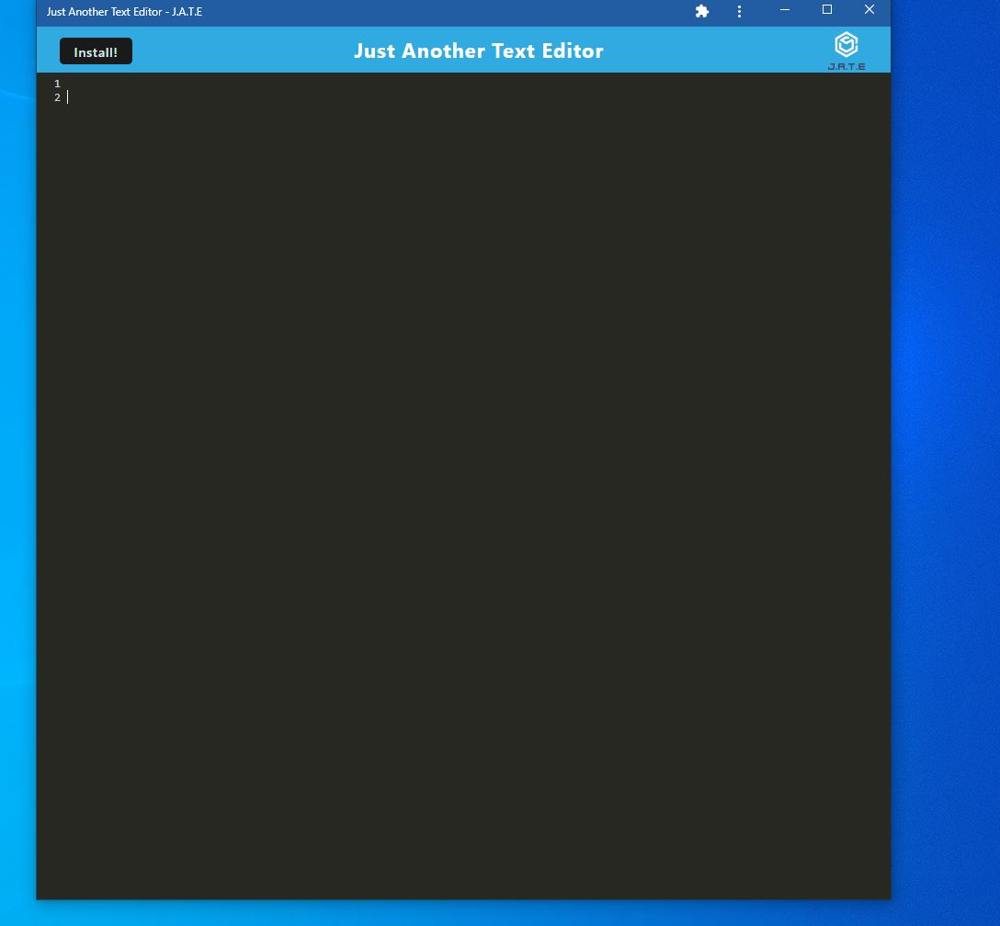

# <Just-Another-Text-Editor>

## Description

This project was meant to help me practice what it means to make a progressive web application. In doing so, I learned a lot more about the functionality of service workers and their uses, especially in allowing the user to cache data so they can work offline. The application does not have an extremely fancy purpose, it's Just Another Text Editor, but it's amazing how much actually goes into the backend of such a "simple" application.

## Installation

Make sure to use "npm install" in the root folder to get the necessary packages/dependencies, if you are not using it from the heroku deployed site that is.

## Usage

After installing the dependencies, make sure to use "npm run start" to boot up the application. Again, this is if you are not using the heroku deployed site.
If you do want to checkout the deployed site instead, please use the following link: https://ancient-lake-74528.herokuapp.com/

Here are the different features of the J.A.T.E. application:

This is what you will see first:

If you open up the Developer Tools and select the Application and Manifest, you should be able to see the following:

Next is the Service Worker:

Followed by IndexedDB:

And finally, if you click the "Install" button on the top left of the page in the navigation, you will be prompted for a quick install, allowing the application to break free from the window.

## Credits

Thank you to https://github.com/Xandromus for the starter code for this project. Make sure to check out his profile.

And here is myself: https://github.com/provostma21
I am still learning and appreciate any tips!
